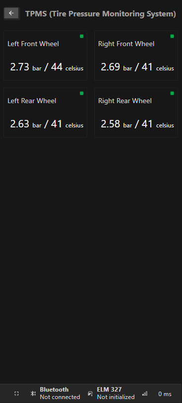
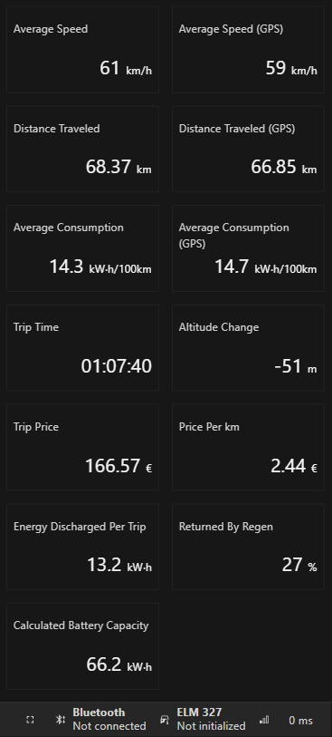

[](https://vshymanskyy.github.io/StandWithUkraine/)

# Niro Spy

Companion app for the Kia e-Niro and Huyndai Kona.

Allows to monitor live data and charts, exporting and importing trip recording.

Works with BLE (Bluetooth 4+) OBD2 adapters and browsers supporting Web Bluetooth API.

Language support:

- [Ukrainian](https://niro-spy.tupychak.com.ua/?lang=uk)
- [English](https://niro-spy.tupychak.com.ua/?lang=en)
- [Korean](https://niro-spy.tupychak.com.ua/?lang=ko)
- [Slovak](https://niro-spy.tupychak.com.ua/?lang=sk)

## Screenshots

### Main screen


### All OBD2 parameters


### Charts for OBD2 parameters


### Battery info page


### TPMS (tire temperature and pressure monitoring)



### VIN


### Trip info page




### Supported languages


### Debugger (CAN message explorer)


## Developing

Install dependencies with `npm install` (or `pnpm install` or `yarn`).

Start a development server:

```bash
npm run dev

# or start the server and open the app in a new browser tab
npm run dev -- --open
```

## Building

To create a production version of your app:

```bash
npm run build
```

You can preview the production build with `npm run preview`.
